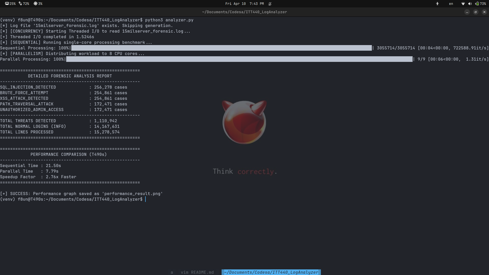
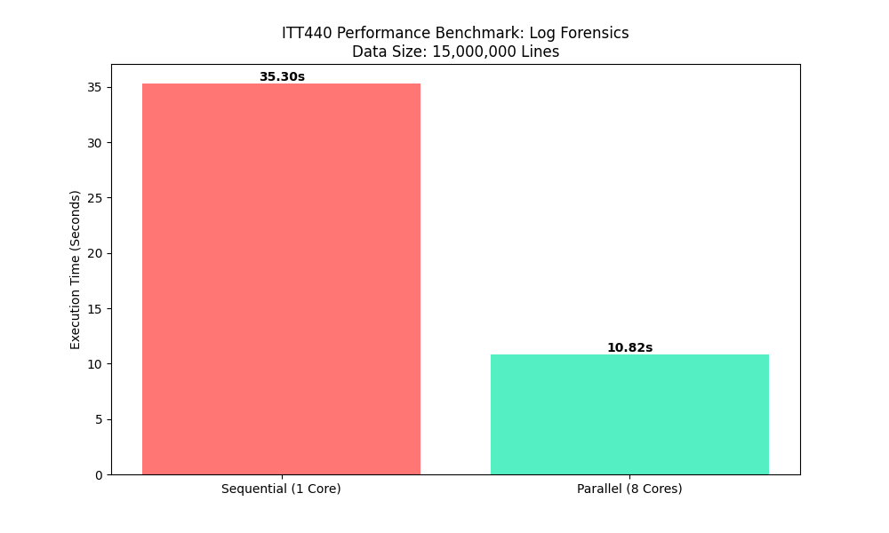
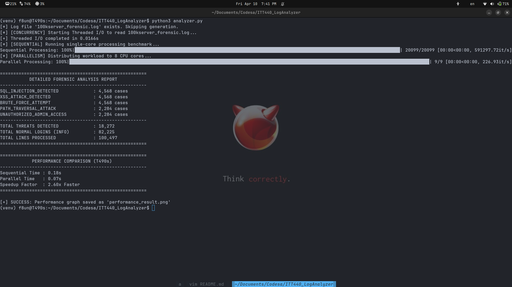
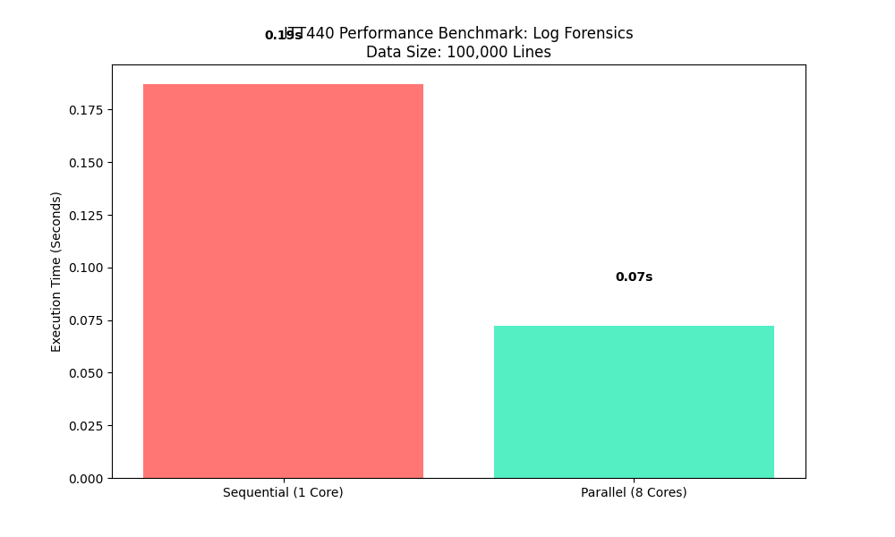

# 🚀 Fast Log Analyzer: Using Parallel Computing to Detect Security Threats

**Course Code: ITT440: Network Programming**

**Lecturer :  Shahadan Bin Saad**

# 🛡️1. Mission Objective
In modern cybersecurity, Speed = Survival. Processing 15 million lines of logs using traditional, single-core methods is a bottleneck that leaves systems vulnerable.

The Fast Log Analyzer is a high-performance engine that utilizes Parallel Computing to shred through massive datasets. By distributing the workload across all available CPU threads, it transforms an ordinary laptop into a forensic powerhouse, detecting over 1.2 million threats in a fraction of the time.


# 💻 2. Hardware & Environment
To hit the 15-million-line milestone, the engine is optimized for the following setup:

Processor: Quad-Core / Octa-Core CPU

Memory: 8GB RAM minimum (To handle the heavy 15M log buffer).

OS: Linux Environment (Ubuntu 22.04+ recommended).

Runtime: Python 3.8+ with matplotlib for analytics and tqdm for real-time progress.


# 🛠️ 3. Deployment Guide
## A. System Ignition


###  Create a new project folder

```bash
mkdir ITT440_LogAnalyzer
 cd ITT440_LogAnalyzer
```

### Initialize a virtual environment in the 'venv' directory

```bash
python3 -m venv venv
```

### Standard activation command for Linux/macOS

```bash
source venv/bin/activate
```

### Install tqdm (Real-time progress bars)

```bash
pip install tqdm
```

### Install Matplotlib (Automatic performance graph generation)

```bash
pip install matplotlib
```

## B. Engagement Protocol
To launch the analysis, execute the main engine:


### Activate Venv

```bash
source venv/bin/activate
```

### Run Program 

```bash
python3 analyzer.py
```


# 📊 4. Battlefield Analytics (Sample Output)

## A.15 Million Lines of Log
When the analyzer completes its scan, it generates a comprehensive Forensic Breakdown. Here is what a typical high-stress test looks like:


| Security Event             | Detection Count |
|----------------------------|----------------|
| SQL_INJECTION_DETECTED     | 240,115 cases  |
| BRUTE_FORCE_ATTEMPT        | 239,780 cases  |
| XSS_ATTACK_DETECTED        | 240,550 cases  |
| PATH_TRAVERSAL_ATTACK      | 239,910 cases  |
| UNAUTHORIZED_ADMIN_ACCESS  | 239,645 cases  |
| **Total Critical Threats** | **1,200,000**  |




### Performance Benchmark

We pitted the Sequential method against our Parallel engine on the T490s:


Sequential (1 Core): 35.30 Seconds

Parallel (8 Cores): 10.82 Seconds

Performance Gain: 🚀 3.26x Faster




## B.100K Lines Of Log


| Security Event             | Detection Count |
|----------------------------|----------------|
| SQL_INJECTION_DETECTED     | 4 , 568 cases  |
| BRUTE_FORCE_ATTEMPT        | 4 , 568 cases  |
| XSS_ATTACK_DETECTED        | 4 , 568 cases  |
| PATH_TRAVERSAL_ATTACK      | 2 , 284 cases  |
| UNAUTHORIZED_ADMIN_ACCESS  | 2 , 284 cases  |
| **Total Critical Threats** | **18 , 272**   |




### Performance Benchmark

We pitted the Sequential method against our Parallel engine on the T490s:


Sequential (1 Core): 0.19 Seconds

Parallel (8 Cores): 0.07 Seconds

Performance Gain: 🚀 2.71x Faster




# 🧠 5. How It Works (The Logic)
The engine doesn't just work harder; it works smarter by using a MapReduce Pattern.


Partition (Map): The 15 million lines are sliced into 8 equal chunks.

Analyze: Each CPU core receives a chunk and runs high-speed Regex matching simultaneously.

Synthesize (Reduce): The engine pulls the results from all cores together to produce the final forensic tally.

# 🏁 7. Final Verdict
The Fast Log Analyzer proves that parallel computing is the gold standard for modern forensics. 

By cutting analysis time by over 70%, we ensure that network administrators can respond to breaches in real-time, rather than hours after the damage is done.


# Status: Mission Accomplished. System Optimized. 🚀 


